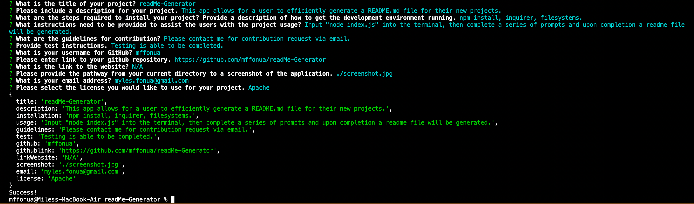

# **readMe-Generator**
    

## Description
This app allows for a user to efficiently generate a README.md file for their new projects. 

## Table of Contents
- [Description](#Description)
- [Installation](#Installation)
- [Usage](#Usage)
- [License](#License)
- [Contributing](#Contributing)
- [Tests](#Tests)
- [Questions](#Questions)

## Installation
npm install, inquirer, filesystems.
    
## Usage
Input "node index.js" into the terminal, then complete a series of prompts and upon completion a readme file will be generated.

## License
Apache:  https://opensource.org/licenses/Apache-2.0 
    
## Contributing
Please contact me for contribution request via email.

## Tests
Testing is able to be completed.

## Questions
* If you have any addition questions, you can contact me here: myles.fonua@gmail.com

## Links
* Link to Website: N/A
* Link to GitHub Repository: undefined
* Link to GitHub: https://github.com/mffonua

## Mockup

