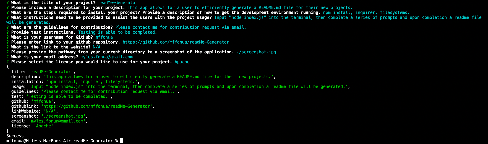

# **readMe-Generator**

## Table of Contents
- [Description](#Description)
- [Installation](#Installation)
- [Usage](#Usage)
- [License](#License)
- [Contributing](#Contributing)
- [Tests](#Tests)
- [Questions](#Questions)

## Description 
 This app was created to allow for a user to be more time-efficent when creating the "perfect" README file for a project (as there are certain criteria like instructions, how to install, usage, etc.) Using this command-line application that incorporates Node.js a user will have to struggle with creating a README again.

## Installation
To generate your own README, open your terminal and navigate to the folder of your project.

Run `npm install` in order to install the npm package dependencies as specified in the `package.json`. `inquirer` will prompt you for your inputs from the command line. 

This application will start by running `node index.js` from the command line. Follow the prompts to generate the README file. 

After answering all the prompts, your README file will be named 'MockupREADME.md' and will be ready for you at the root of the repository. 

## Usage
 ![Screenrecord of App]https://user-images.githubusercontent.com/108596346/191172083-5e1224a2-4e52-480a-9077-a2f096bc646d.mp4

 ## License
 MIT: https://opensource.org/licenses/MIT

 ## Questions
* If you have any addition questions, you can contact me via email: myles.fonua@gmail.com

## Mockup

## Links
* Link to GitHub Repository: https://github.com/mffonua/readMe-Generator
* Link to My Personal GitHub: https://github.com/mffonua  